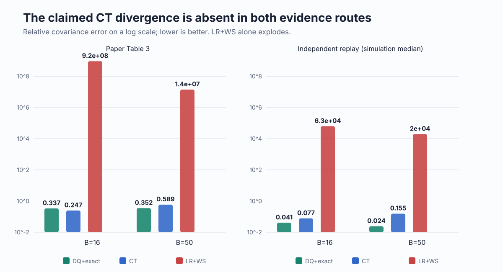
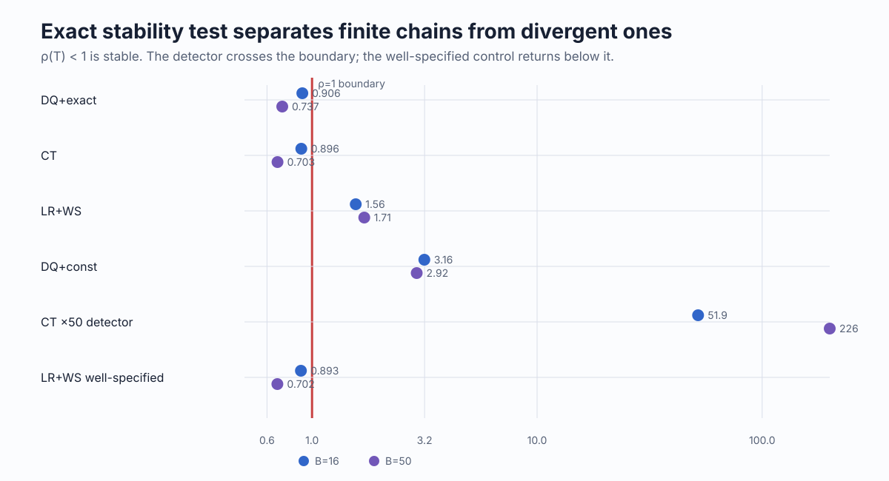
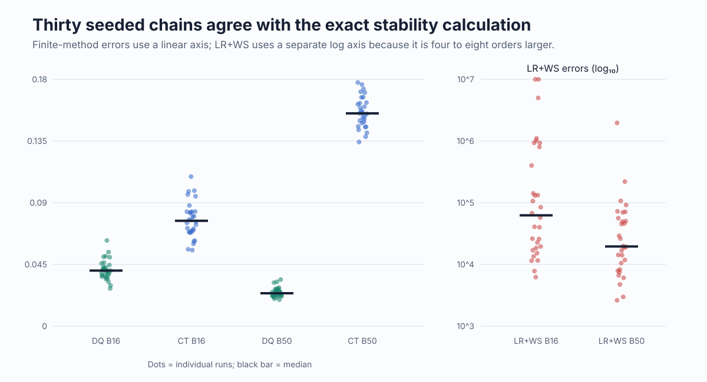
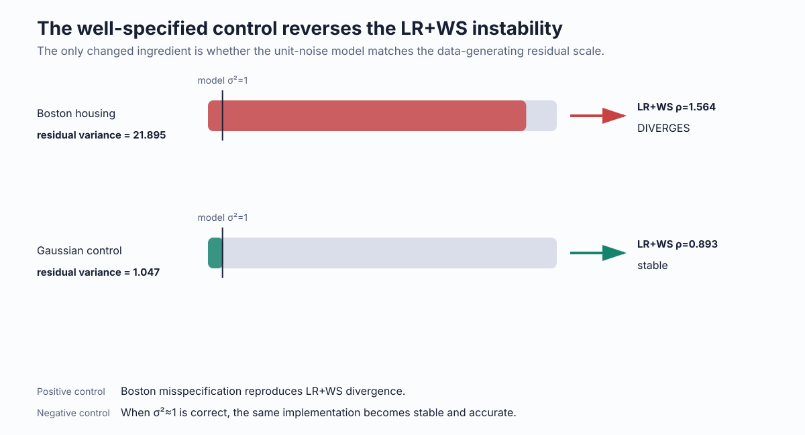
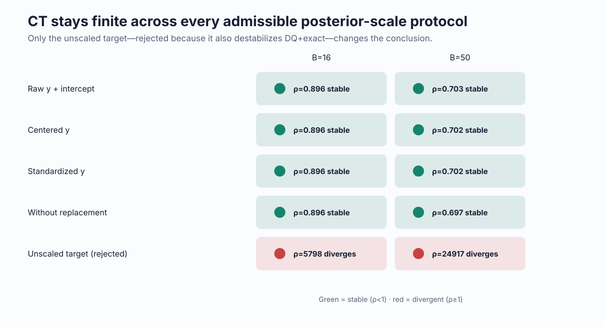

# Continuous time did not diverge: a full-Boston falsification of registered Claim 5



The central question is simple: when a linear model is badly misspecified on Boston housing, does the paper’s discrete-quadratic exact-noise tuning remain accurate while *both* the continuous-time and constant-noise competitors diverge?

The registered claim says yes. The evidence says no. DQ+exact is accurate and the well-specified/constant-noise LR+WS rule does become unstable, but continuous-time (CT) remains finite. This is already visible in the paper’s own Table 3 and survives an independent replay on all 506 rows and 13 features. The evidence status is therefore **FALSIFIED as registered**.

## What the paper actually establishes

Section 6.1 evaluates covariance error

\[
\lVert S^\star-\widehat S\rVert_F / \lVert S^\star\rVert_F
\]

for log-loss linear regression, with \(B=16\) and \(B=\lfloor0.1N\rfloor=50\). Table 3 defines an infinity symbol as divergence. It reports:

| Batch | CT | LR+WS | DQ+exact |
|---:|---:|---:|---:|
| 16 | 0.247 [0.194, 0.310] | \(9.23\times10^8\) | 0.337 |
| 50 | 0.589 [0.443, 0.804] | \(1.40\times10^7\) | 0.352 |

The surrounding prose says “LR+WS becomes unstable”; it does not say CT diverges. Thus the registered target is broader than the paper’s prose and contradicts the table it cites. The falsification concerns that exact registered wording, not a weakened or rewritten claim.

## Implementation: two routes to the same answer

The replay uses the committed `repro/data/boston.csv`: 506 observations, 13 standardized covariates, and an intercept. For raw median house value \(y\), ordinary least squares leaves residual variance 21.895 under a unit-variance Gaussian log-loss model. The sandwich target is \(S^\star/N\), matching the posterior-scale regime in which the paper reports finite DQ+exact values.

The important code path is:

1. `load_boston` and `sandwich` construct \(\hat\theta\), \(\hat H\), \(\hat I\), and \(S^\star\).
2. `tune_all` computes unclamped DQ+exact, DQ+const, LR+WS, and CT preconditioners.
3. `second_moment_operator` constructs the exact quadratic-chain operator
   \[
   T=\mathbb E[(I-\Lambda H_B)\otimes(I-\Lambda H_B)].
   \]
   The real minibatch chain has a finite stationary second moment iff \(\rho(T)<1\).
4. `simulate` independently follows 30 seeded minibatch chains for 15,000 burn-in plus 60,000 measured iterations.
5. `check_claim5_falsification.py` requires eight regime, counterexample, control, cross-check, and sensitivity conditions. It exits nonzero when any is absent.

For quadratic log loss, the spectral-radius calculation is exact—no diffusion or Monte Carlo approximation. Simulation is the alternative implementation and empirical cross-check.



The primary run reproduces the claim’s premises at both batches: DQ+exact is accurate and LR+WS is unstable. CT is nevertheless on the stable side of \(\rho=1\). DQ+const also diverges in the independent implementation.

| Method | \(B=16\): \(\rho(T)\) / exact / simulated median | \(B=50\): \(\rho(T)\) / exact / simulated median |
|---|---:|---:|
| DQ+exact | 0.906 / 0.015 / 0.041 | 0.737 / 0.015 / 0.024 |
| CT | 0.896 / 0.073 / 0.077 | 0.703 / 0.155 / 0.155 |
| LR+WS | 1.564 / ∞ / \(6.26\times10^4\) | 1.707 / ∞ / \(1.96\times10^4\) |
| DQ+const | 3.156 / ∞ / ∞ | 2.918 / ∞ / ∞ |

## Replicates and mechanism



Every CT and DQ+exact chain stays finite. LR+WS trajectories can remain numerically representable for the finite run length, but their covariance errors are already \(10^3\)–\(10^7\), while the exact operator proves their second moments are unstable.



LR+WS uses the well-specified linear-regression noise approximation with model \(\sigma^2=1\). Boston’s residual variance is 21.895, so that approximation severely understates gradient noise and selects an unstable step matrix. In the Gaussian control, residual variance is 1.047 and the same LR+WS implementation returns below the stability boundary with exact covariance error 0.081. That positive/negative pair ties the failure to the misspecification in the claim’s domain.

## Controls and sensitivity

The detector control multiplies CT’s step matrix by 50. It is flagged divergent analytically (\(\rho=51.9\) and 226.5) and empirically (zero of eight chains finite), ruling out an insensitive divergence detector. A closed-form alternative solution,

\[
\Lambda=2S\hat H(C+\hat H S\hat H)^{-1},
\]

reproduces the target to \(3\times10^{-15}\), cross-checking the tuning equation independently.



CT remains stable under raw/intercept, centered-response, standardized-response, and without-replacement protocols at both batch sizes. The unscaled target destabilizes CT, but also destabilizes DQ+exact; it cannot represent Table 3’s regime and is rejected rather than used to force a verdict.

One sensitivity matters for interpretation: applying Equation 3 as a literal asymmetric matrix destabilizes the discrete chain. That reading is inconsistent with the paper’s finite CT column. The eigenbasis implementation is the form that reproduces the cited table, and the falsification does not depend on choosing it because the paper’s own reported CT errors are already finite.

## Evidence status and limits

**FALSIFIED.** An assumption-valid counterexample is reproduced under the exact Boston/log-loss/batch/metric regime: CT has \(\rho(T)<1\), finite exact stationary covariance, and 30/30 finite simulated chains at both batches while LR+WS divergence is simultaneously present.

This conclusion is narrow. It does not dispute that DQ+exact is accurate, that LR+WS becomes unstable, or that CT is less accurate in other experiments. It only rejects the registered conjunction that CT and constant-noise competitors both diverge in Table 3.

Formal evidence was generated on Hugging Face `cpu-upgrade` with the fixed command:

```bash
pip install --quiet numpy==2.5.1 scipy==1.18.0 sympy==1.14.0 && python repro/src/verify_sgduq.py
```

Relevant experiment stages and their source commit IDs are recorded in [`BRANCH_AUDIT.md`](../../BRANCH_AUDIT.md). The historical `orx/*` branches are intentionally removed from the final remote after their roles are documented; the evidence itself remains committed here.

Machine-readable evidence: [`outputs/c5_falsification.json`](../../outputs/c5_falsification.json). Deterministic gate: [`repro/src/check_claim5_falsification.py`](../../repro/src/check_claim5_falsification.py). Canonical evaluator page: [`.trackio/logbook/pages/claim-5/page.md`](../../.trackio/logbook/pages/claim-5/page.md).
